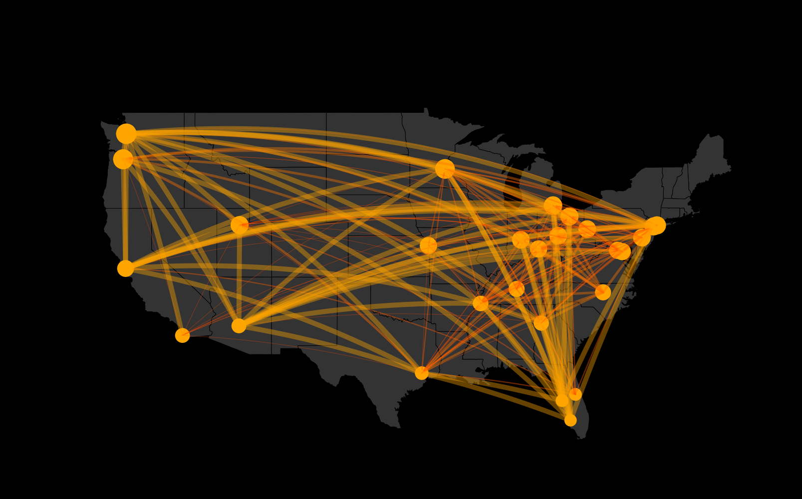

# Lookup layouts of igraph

```{r}
grep("^layout_", ls("package:igraph"), value=TRUE)[-1]
```

# Network D3

```{r}
library(networkD3)
nodes <- read_csv("data_sb/Dataset1-Media-Example-NODES.csv")
links <- read_csv("data_sb/Dataset1-Media-Example-EDGES.csv")
```

```{r}
links.d3 <- tibble(from=as.integer(factor(links$from))-1,
                       to=as.integer(factor(links$to))-1 )
nodes_d3 <- nodes %>%
  mutate(idn=factor(nodes$media, levels=nodes$media)) %>%
  select(idn,everything()) # idn tem q ser a primeira coluna
```

```{r}
forceNetwork(Links = links.d3, Nodes = nodes_d3, Source="from", Target="to",
             NodeID = "idn", # must be first column in Nodes df
             Group = "type.label", linkWidth = 1,
             linkColour = "#afafaf", fontSize=12, zoom=T, legend=T,
             Nodesize=6, opacity = 1, charge=-600,
             width = 600, height = 600)
```


```{r}
tutte_links_d3 <- tutte_grouped %>%
  as_data_frame() %>%
  mutate(from=as.integer(as.factor(from))-1L,
         to=as.integer(as.factor(to))-1L) %>%
  as.data.frame()
```

```{r}
tutte_grouped %>% V %>% as.numeric
```


```{r}
tutte_nodes_d3 <- data_frame(nodes=tutte_grouped %>% V %>% as.character,
                             idn=c("xxx")) %>%
  as.data.frame()
```


```{r}
nodes.d3 <- cbind(idn=factor(nodes$media, levels=nodes$media), nodes)
```


<!-- Iverton: consegue fazer este mapa em leaflet?  -->




# Highschool dataset


Setenta alunos de uma escola (numerados de 1 a 70) foram feitos a seguinte pergunta: "com quais outros alunos desta escola você interage?". Esta pergunta foi repetida nos anos de 1957 e 1958, ou seja pode-se visualizar a evolução de amizades sobre este período.


```{r}
highschool %>% as_tibble()
```

Quantos alunos distintos?

```{r}
highschool$from %>% n_distinct()
highschool$to %>% n_distinct()
```

Quantos anos distintos

```{r}
highschool %>% count(year)
```

Carrega dados de amizades em highschool nos anos de 1957 e 1958

```{r}
# nota: with tidygraph use as_tbl_graph
graph <- graph_from_data_frame(highschool)
```

```{r}
# Not specifying the layout - defaults to "auto"
ggraph(graph) + 
    geom_edge_link(aes(colour = factor(year))) + 
    geom_node_point()
```

possible layouts: star, circle, grid, sphere, kk, fr, mds, lgl


```{r}
ggraph(graph, layout = 'grid') + 
  geom_node_point(size=1,color="black") +
  geom_edge_link(aes(colour = factor(year)))
```

New friendships

```{r}
graph_new_friendship <- highschool %>%
  filter(year==1958) %>%
  anti_join(highschool %>% filter(year==1957),by=c(from="from",to="to")) %>%
  graph_from_data_frame()
```

```{r}
ggraph(graph_new_friendship, layout = 'grid') + 
  geom_node_point(size=1,color="black") +
  geom_edge_link() +
  coord_fixed()
```

o dataset `flare` é uma hierarquia de classes de uma biblioteca de software (ActionScript), lista de 3 data frames.

```{r}
flare %>% map(glimpse)
```

# net dataset

```{r}
nodes <- read.csv("data_sb/Dataset1-Media-Example-NODES.csv", header=T, as.is=T)
links <- read.csv("data_sb/Dataset1-Media-Example-EDGES.csv", header=T, as.is=T)
head(nodes)
head(links)
```

Transforma em objeto do igraph

```{r}
net <- graph_from_data_frame(d=links, vertices=nodes, directed=T)
```

Atribui cores baseadas no media.type

```{r}
V(net)$media.type
```


```{r}
colrs <- c("gray50", "tomato","gold")
V(net)$color <- colrs[V(net)$media.type]
```


```{r}
net %>%
  ggraph(layout="lgl") +
  geom_edge_fan(color="gray50", width=0.8, alpha=0.5) +
  geom_node_point(aes(color=color), size=8) +
  scale_color_manual(values=colrs %>% set_names(colrs)) +
  theme_void()
```

## Community detection

```{r}
clp <- cluster_optimal(net)
class(clp)
```

```{r}
clp
```


```{r}
V(net)$community <- clp$membership
```

```{r}
plot(clp, net, edge.arrow.size=.5)
```


# Flare: gierarquico

```{r}
graph_flare <- graph_from_data_frame(flare$edges, vertices = flare$vertices)
ggraph(graph_flare, 'dendrogram',circular=T) + 
  geom_edge_diagonal() +
  geom_node_point() +
  coord_fixed()
```


```{r}
flaregraph <- graph_from_data_frame(flare$edges, vertices = flare$vertices)
from <- match(flare$imports$from, flare$vertices$name)
to <- match(flare$imports$to, flare$vertices$name)
ggraph(flaregraph, layout = 'dendrogram', circular = TRUE) + 
    geom_conn_bundle(data = get_con(from = from, to = to), alpha = 0.1) + 
    coord_fixed()
```

# Read Enron file


```{r}
df_enron <- read_delim("data/email-enron-only.mtx",
                       delim=fixed(" "),
                       skip = 2,
                       col_names = c("from","to"),
                       col_types = c("ii"))
```

```{r}
df_enron %>%
  arrange(from)
```


```{r}
graph_enron <- df_enron %>%
  as_tbl_graph(directed=T) %>%
  mutate(degree = tidygraph::centrality_degree(),
         group = tidygraph::group_infomap() %>% as.factor,
         centrality = tidygraph::centrality_betweenness())
```

```{r}
V(graph_enron)$group
```


```{r}
tibble(degree=V(graph_enron)$degree) %>%
  ggplot(aes(x=degree)) +
  geom_histogram()
```


possible layouts: star, circle, grid, sphere, kk, fr, mds, lgl

```{r}
graph_enron %>%
  #filter(as.numeric(degree)>8) %>%
  ggraph(layout="fr") +
  geom_edge_fan() +
  geom_node_point(aes(color=group,size=degree))
```